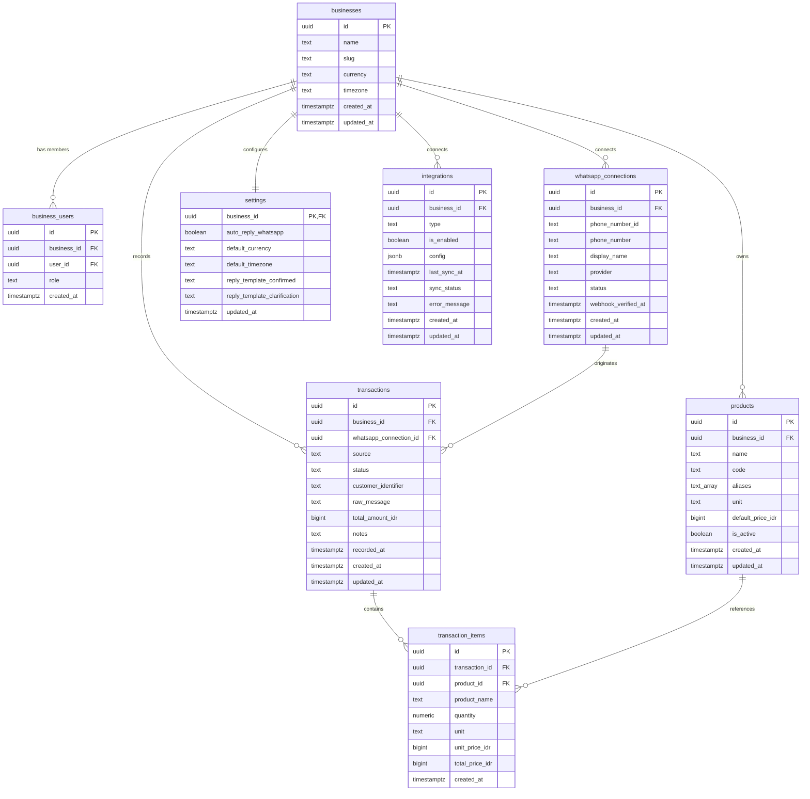

# OXID WA Ledger — Database Architecture Specification

> **Version**: 1.0.0 (Foundation)  
> **Status**: Planned Architecture (No production migrations applied yet)  
> **Storage Engine**: Supabase PostgreSQL  
> **Tenant Boundary**: `business_id` (Multi-tenant SaaS)

---

## 1. Architectural Principles

1. **`business_id` as the Strict Tenant Boundary**  
   Every operational entity (`products`, `whatsapp_connections`, `transactions`, `settings`, `integrations`) is scoped to a `business_id`. Row Level Security (RLS) policies enforce data isolation across tenants using authenticated user memberships.

2. **Decoupled Identity & Replaceable WhatsApp Connections**  
   A business's identity, history, and ledger records do NOT depend on a WhatsApp phone number. Phone numbers are dynamic communication channels (`whatsapp_connections`) that can be linked, unlinked, rotated, or replaced without affecting transactions, customer records, or financial history.

3. **PostgreSQL as the Single Source of Truth**  
   All transaction state, parser audit trails, customer interactions, and aggregations live authoritatively in PostgreSQL. Downstream destinations (such as Google Sheets, CSV exports, or webhooks) are asynchronous, optional replicas.

4. **Monetary Precision & Zero Floating-Point Errors**  
   Currency values (e.g. Indonesian Rupiah - IDR) are stored as integer or exact fixed-point `numeric` (e.g., `BIGINT` representing whole IDR or `numeric(15,2)`). JavaScript floating-point calculations (`0.1 + 0.2`) are strictly prohibited in database columns and calculation flows.

5. **Decimal Quantities Support**  
   Quantities are stored using `numeric(12, 3)` to support fractional weights and measurements (e.g., `1.5 kg`, `20.75 kg`, `0.25 liter`) alongside whole discrete quantities (`10 pcs`).

6. **Mandatory Row Level Security (RLS)**  
   No table in the `public` schema may have RLS disabled. Every table must define explicit policies for `SELECT`, `INSERT`, `UPDATE`, and `DELETE` tied to the user's active membership in `business_users`. No wildcard or open `true` policies are permitted.

---

## 2. Entity-Relationship Model



---

## 3. Entity Specifications

### 3.1 `businesses` (Tenants)
The core tenant entity. All organizational assets and transactions are bound to this record.
- `id` (`UUID`, PK, default `gen_random_uuid()`): Unique identifier for the tenant.
- `name` (`TEXT`, NOT NULL): Registered business name.
- `slug` (`TEXT`, NOT NULL, UNIQUE): URL-friendly unique identifier.
- `currency` (`TEXT`, NOT NULL, DEFAULT `'IDR'`): Base currency code.
- `timezone` (`TEXT`, NOT NULL, DEFAULT `'Asia/Jakarta'`): Timezone for day-boundary calculation.
- `created_at` (`TIMESTAMPTZ`, NOT NULL, DEFAULT `now()`).
- `updated_at` (`TIMESTAMPTZ`, NOT NULL, DEFAULT `now()`).

### 3.2 `business_users` (Memberships & RBAC)
Maps Supabase `auth.users` to businesses with role-based permissions.
- `id` (`UUID`, PK, default `gen_random_uuid()`).
- `business_id` (`UUID`, NOT NULL, FK → `businesses.id` ON DELETE CASCADE).
- `user_id` (`UUID`, NOT NULL, FK → `auth.users.id` ON DELETE CASCADE).
- `role` (`TEXT`, NOT NULL, CHECK in (`'owner'`, `'admin'`, `'member'`)).
- `created_at` (`TIMESTAMPTZ`, NOT NULL, DEFAULT `now()`).
- **Constraint**: `UNIQUE(business_id, user_id)` (A user belongs to a business once).

### 3.3 `products` (Catalog & Pricing)
Flexible product catalog. Not hardcoded to any specific domain (e.g. catfish pilot is simply a product entry with unit `'kg'`).
- `id` (`UUID`, PK, default `gen_random_uuid()`).
- `business_id` (`UUID`, NOT NULL, FK → `businesses.id` ON DELETE CASCADE).
- `name` (`TEXT`, NOT NULL): Primary product name (e.g., `"Lele Segar"`).
- `code` (`TEXT`, NULL): Optional SKU or short code.
- `aliases` (`TEXT[]`, NOT NULL, DEFAULT `ARRAY[]::TEXT[]`): Natural language synonyms for parser recognition (e.g., `["ikan lele", "lele", "catfish"]`).
- `unit` (`TEXT`, NOT NULL, DEFAULT `'kg'`): Measurement unit (`"kg"`, `"pcs"`, `"liter"`).
- `default_price_idr` (`BIGINT`, NOT NULL): Integer IDR price per unit (e.g., `28000`).
- `is_active` (`BOOLEAN`, NOT NULL, DEFAULT `true`).
- `created_at` (`TIMESTAMPTZ`, NOT NULL, DEFAULT `now()`).
- `updated_at` (`TIMESTAMPTZ`, NOT NULL, DEFAULT `now()`).

### 3.4 `whatsapp_connections` (Decoupled Channels)
Handles communication channel metadata. Decoupled from tenant identity so numbers can be changed without data disruption.
- `id` (`UUID`, PK, default `gen_random_uuid()`).
- `business_id` (`UUID`, NOT NULL, FK → `businesses.id` ON DELETE CASCADE).
- `phone_number_id` (`TEXT`, NOT NULL): Meta Cloud API or provider phone identifier.
- `phone_number` (`TEXT`, NOT NULL): Formatted phone number (E.164, e.g. `"+6281234567890"`).
- `display_name` (`TEXT`, NULL): Registered business display name on WhatsApp.
- `provider` (`TEXT`, NOT NULL, DEFAULT `'meta_cloud_api'`): WhatsApp BSP or API engine.
- `status` (`TEXT`, NOT NULL, DEFAULT `'disconnected'`): `'connected'`, `'disconnected'`, `'pending_verification'`, `'rate_limited'`.
- `webhook_verified_at` (`TIMESTAMPTZ`, NULL).
- `created_at` (`TIMESTAMPTZ`, NOT NULL, DEFAULT `now()`).
- `updated_at` (`TIMESTAMPTZ`, NOT NULL, DEFAULT `now()`).

### 3.5 `transactions` (Ledger Entries)
Primary financial records.
- `id` (`UUID`, PK, default `gen_random_uuid()`).
- `business_id` (`UUID`, NOT NULL, FK → `businesses.id` ON DELETE RESTRICT).
- `whatsapp_connection_id` (`UUID`, NULL, FK → `whatsapp_connections.id` ON DELETE SET NULL).
- `source` (`TEXT`, NOT NULL, DEFAULT `'whatsapp'`): `'whatsapp'`, `'manual'`, `'api'`.
- `status` (`TEXT`, NOT NULL, DEFAULT `'confirmed'`): `'pending'`, `'confirmed'`, `'cancelled'`.
- `customer_identifier` (`TEXT`, NULL): Customer telephone number or identifier.
- `raw_message` (`TEXT`, NULL): Preserved inbound message (e.g., `"Kejual 30kg"`) for auditability.
- `total_amount_idr` (`BIGINT`, NOT NULL): Total transaction value in IDR (integer).
- `notes` (`TEXT`, NULL): Optional operator notes.
- `recorded_at` (`TIMESTAMPTZ`, NOT NULL, DEFAULT `now()`): Actual sale timestamp.
- `created_at` (`TIMESTAMPTZ`, NOT NULL, DEFAULT `now()`).
- `updated_at` (`TIMESTAMPTZ`, NOT NULL, DEFAULT `now()`).

### 3.6 `transaction_items` (Line Items)
Fractional quantity support and itemized breakdown.
- `id` (`UUID`, PK, default `gen_random_uuid()`).
- `transaction_id` (`UUID`, NOT NULL, FK → `transactions.id` ON DELETE CASCADE).
- `product_id` (`UUID`, NULL, FK → `products.id` ON DELETE SET NULL).
- `product_name` (`TEXT`, NOT NULL): Historical snapshot of the product name.
- `quantity` (`NUMERIC(12, 3)`, NOT NULL): Fractional decimal quantity (e.g. `30.000` or `1.750`).
- `unit` (`TEXT`, NOT NULL): Unit snapshot (e.g. `'kg'`).
- `unit_price_idr` (`BIGINT`, NOT NULL): Snapshot of unit price at time of sale.
- `total_price_idr` (`BIGINT`, NOT NULL): `round(quantity * unit_price_idr)`.
- `created_at` (`TIMESTAMPTZ`, NOT NULL, DEFAULT `now()`).

### 3.7 `settings` (Business Configurations)
Tenant-level configuration parameters.
- `business_id` (`UUID`, PK, FK → `businesses.id` ON DELETE CASCADE).
- `auto_reply_whatsapp` (`BOOLEAN`, NOT NULL, DEFAULT `true`).
- `default_currency` (`TEXT`, NOT NULL, DEFAULT `'IDR'`).
- `default_timezone` (`TEXT`, NOT NULL, DEFAULT `'Asia/Jakarta'`).
- `reply_template_confirmed` (`TEXT`, NULL): Customizable reply template.
- `reply_template_clarification` (`TEXT`, NULL): Fallback message when parser asks for confirmation.
- `updated_at` (`TIMESTAMPTZ`, NOT NULL, DEFAULT `now()`).

### 3.8 `integrations` (Downstream Outputs)
Configuration for external sinks (e.g. Google Sheets, webhooks).
- `id` (`UUID`, PK, default `gen_random_uuid()`).
- `business_id` (`UUID`, NOT NULL, FK → `businesses.id` ON DELETE CASCADE).
- `type` (`TEXT`, NOT NULL): `'google_sheets'`, `'webhook'`.
- `is_enabled` (`BOOLEAN`, NOT NULL, DEFAULT `false`).
- `config` (`JSONB`, NOT NULL, DEFAULT `'{}'::jsonb`): Spreadsheet ID, sheet tab, credentials reference.
- `last_sync_at` (`TIMESTAMPTZ`, NULL).
- `sync_status` (`TEXT`, NOT NULL, DEFAULT `'idle'`): `'idle'`, `'in_progress'`, `'success'`, `'error'`.
- `error_message` (`TEXT`, NULL).
- `created_at` (`TIMESTAMPTZ`, NOT NULL, DEFAULT `now()`).
- `updated_at` (`TIMESTAMPTZ`, NOT NULL, DEFAULT `now()`).

---

## 4. Row Level Security (RLS) Strategy

All tables enforce tenant boundaries using helper functions:

```sql
-- Helper function to check if the active user is a member of the given business
CREATE OR REPLACE FUNCTION public.is_business_member(business_id uuid)
RETURNS boolean AS $$
  SELECT EXISTS (
    SELECT 1 FROM public.business_users
    WHERE business_users.business_id = $1
      AND business_users.user_id = auth.uid()
  );
$$ LANGUAGE sql SECURITY DEFINER STABLE;
```

Policies follow this standard pattern:
- **SELECT**: `WHERE is_business_member(business_id)`
- **INSERT**: `WITH CHECK (is_business_member(business_id))`
- **UPDATE**: `USING (is_business_member(business_id))`
- **DELETE**: `USING (is_business_member(business_id) AND has_role(business_id, 'owner'))`

---

## 5. Migration Execution Strategy

- **Phase 1 (Current)**: Architecture design & TypeScript domain contracts.
- **Phase 2 (Future)**: Supabase CLI migration scripts (`supabase/migrations/`) created with idempotent DDL and RLS policies.
- **Phase 3 (Future)**: Seed data scripts for development and verification.
